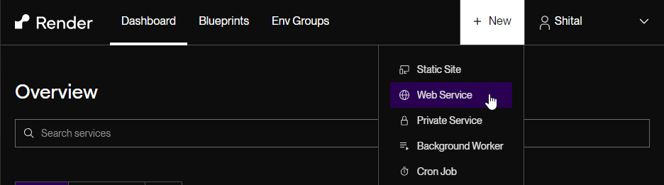
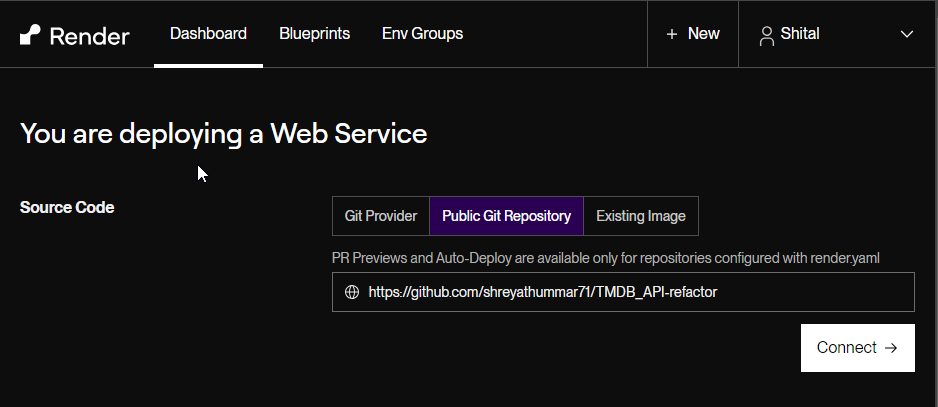
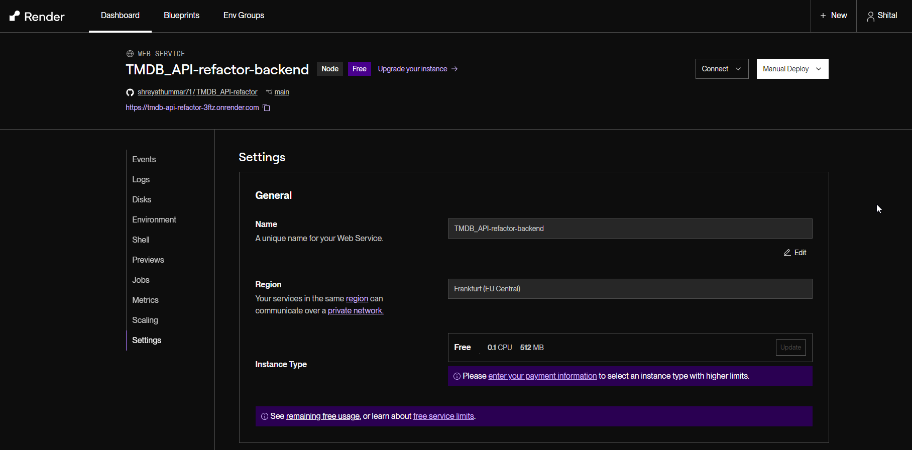
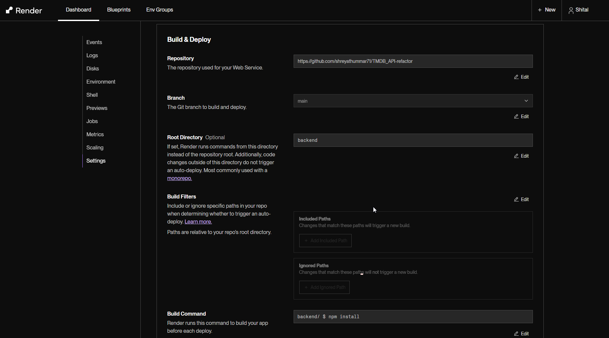
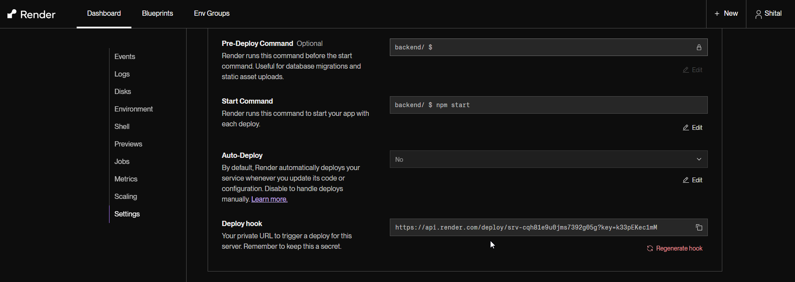
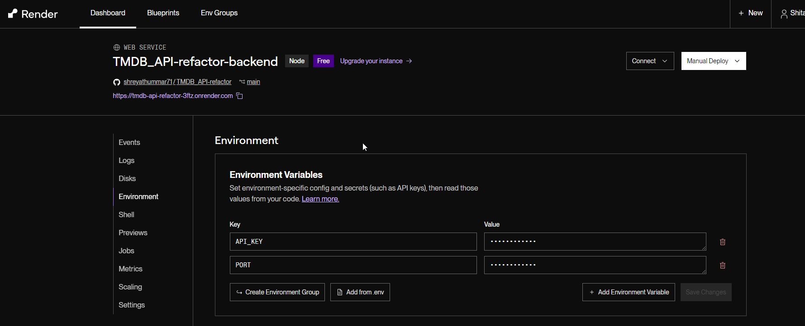

This site was running in [RENDER](https://tmdb-api-refactor-1.onrender.com)

## Refactor

- Added new two static sections on bottom
- Create custom Alert message for save notes and add to favorite button.
- Write comments in journal.js file
- Work on user friendly
  - Add home link to the logo in header
  - add new link "Category" in Header and its navigate to category section.

### Deployment

- Publish directory path is now
  > ./frontend/dist
- Added two Environment Variables as key and value pair

```
 API_KEY="our API key"
 PORT=3000
```

## Refactor code :

### Why Async Function and await Keyword used in search movie event:

The callback function is marked as async. This means it’s an asynchronous function.
Asynchronous functions allow us to work with promises (like the one returned by searchData(searchTerm)).
The await keyword is used to wait for the promise returned by searchData(searchTerm) to resolve.
Essentially, it ensures that the code execution pauses until the promise is fulfilled (i.e., the data is retrieved).

### Why function in try..catch Block

The try Block:\
Inside the try block, we have the main code that we want to execute.
In the main code is the filtering of movies based on the search term.\
The catch Block:\
If an error occurs within the try block, execution jumps immediately to the corresponding catch block.
The catch block is where we define what to do when an error occurs.
In code, the catch block logs an error message to the console using console.error.\
Why Use try...catch?:\
Error handling is crucial for robust applications. Without it, unhandled errors can crash the entire program.
By wrapping potentially problematic code in a try block, we ensure that even if an error occurs, the program won’t abruptly stop.
Instead, it gracefully falls into the catch block, allowing us to handle the error (e.g., log it, display a user-friendly message, or take corrective action).

## How to deploy backed as a web service on render.com

To deploy backed on render following steps are performed

1. On render dashboard select `New -> Web Service`



2. Select repository from `Git Provider` or `Public Git Repository` (Depends on ownership of repository) tab and click `Connect`



3. Modify project `Name` if necessary and select `Region` closer to you. Backend will be deployed on the server in this region by Render. Also select render plan for `Instance Type`, in this deployment free plan is used. In free plan inactive instances may be suspended when inactive. It might take upto 50 Seconds on access to have the instance running again.



4. `Repository` and `Branch` will be populated automatically, update if necessary. Give `Root Directory` as `backend` since backed code is in this directory. Specify `Build Command` as `npm install` to install the npm packages.



5. Specify `Start Command` as `npm start`. This will run the npm webserver on port specified in Environment settings (Specified below). For web services Render default value of `PORT` variable is `10000`



6. To specify environment variables switch to `Environment` tab and specify variables and values as `Key` and `Value` pair. In this deployment `API_KEY` of `TMDB-API` and `PORT` as `3000` is specified.



After deployment is finished backend API URL is as following:

https://tmdb-api-refactor-3ftz.onrender.com/api/movies/popular
